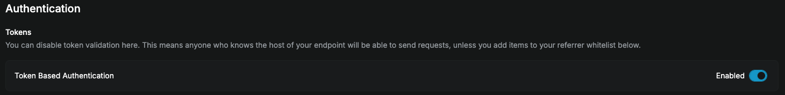

# action-npm-publish

This is a GitHub action that publishes one or more packages within a repo to NPM.

- For a single-package repo, the action will publish the package at the version listed in `package.json`.
- For a multi-package repo (monorepo), the action will iterate through the packages specified by the `workspaces` field in `package.json` and publish each one at the version listed in its `package.json`.

Designed for use with [`action-publish-release`](https://github.com/MetaMask/action-publish-release).

## Usage

### Prequisites

- Ensure your project is using Yarn. Other package managers may not work as expected.
- You'll need to create an NPM token for your repo and set it as a secret under an `npm-publish` environment so that releases can go through an approval step. Reach out to the `@metamask/npm-publishers` group for help on creating the NPM token and setting up this environment.
- If your project is using Yarn Modern, Yarn is configured to use the `node-modules` linker, and your project defines a `prepack` script for any releasable packages, ensure that the file `node_modules/.yarn-state.yml` is present before this action is invoked. This file is generated automatically when installing dependencies. If you want to publish without dependencies present, you can instantiate an empty state file or restore one from a cache.
- The `slack-webhook-url` option for this action makes use of another action, `slackapi/slack-github-action@007b2c3c751a190b6f0f040e47ed024deaa72844`. This action is authored by a Marketplace "verified creator". If your repository or organization restricts which actions can be used and does not allow Marketplace verified creators by default, ensure that this is listed as an allowed action.
- In the job that uses this action, you'll need to first check out the repo, set up Node, and install dependencies. See the "Quick start" example below for more.
- If your project defines a `prepack` script, you will probably want to set `SKIP_PREPACK: true` as an environment variable.

### Quick start

The [`publish-release` workflow](https://github.com/MetaMask/metamask-module-template/blob/main/.github/workflows/publish-release.yml) from the [module template](https://github.com/MetaMask/metamask-module-template) is a live example of how we use this action in many MetaMask projects. In particular it demonstrates

- How we typically check out and set up the repo
- Setting `SKIP_PREPACK: true` to avoid running linting or tests before preparing packages
- Announcing new releases in Slack

The sections below go into more detail on use cases.

### Preparing packages in dry-run mode

By default, without supplying `npm-token`, packages will be prepared for publishing, but no publishing will actually occur. This is useful so that approvers can inspect the package before it is published.

Add this to a job's steps in your workflow:

```yaml
- uses: MetaMask/action-npm-publish@v5
```

### Publishing to NPM

If you supply `npm-token`, then publishing will actually occur. You will probably want to pair this with the previous step:

```yaml
- uses: MetaMask/action-npm-publish@v5
  with:
    npm-token: ${{ secrets.NPM_TOKEN }}
```

### Automatically requesting approvals in Slack

This assumes that you've created an `npm-publish` environment and placed it behind an approval step.

You can notify `@MetaMask/npm-publishers` that a release is ready to be approved by providing a `slack-webhook-url` input:

```yaml
- uses: MetaMask/action-npm-publish@v5
  with:
    slack-webhook-url: ${{ secrets.SLACK_WEBHOOK_URL }}
    subteam: S042S7RE4AE  # @metamask-npm-publishers
```

This posts a message to `#metamask-dev`, such as:



Here is another example that customizes the icon URL, bot name, and channel:

For example:

```yaml
- uses: MetaMask/action-npm-publish@v5
  with:
    slack-webhook-url: ${{ secrets.SLACK_WEBHOOK_URL }}
    icon-url: https://ricky.codes/me.jpg
    username: rickybot
    # re subteam, see: https://api.slack.com/reference/surfaces/formatting#mentioning-groups
    subteam: S042S7RE4AE  # @metamask-npm-publishers
    channel: dev-channel
```

You can read more about these options in the [API](#api) section below.

## API

### Inputs

- **`npm-token`** _(optional)_. The auth token associated with the registry that Yarn commands will use to access and publish packages. If omitted, the action will perform a dry-run publish.
- **`slack-webhook-url`** _(optional)_. The incoming webhook URL associated with your Slack application for announcing releases to a Slack channel. This can be added under the "Incoming Webhooks" section of your Slack app configuration.
- **`icon-url`** _(optional)_. Only applicable if `slack-webhook-url` is set. URL to the avatar used for the bot in Slack. Defaults to the avatar in this repository.
- **`username`** _(optional)_. Only applicable if `slack-webhook-url` is set. The name of the bot as it appears on Slack. Defaults to `MetaMask bot`.
- **`subteam`** _(optional)_. Only applicable if `slack-webhook-url` is set. Use this if you want to ping a subteam of individuals on Slack using `@`.
- **`channel`** _(optional)_. Only applicable if `slack-webhook-url` is set. Use this if you want to post to a channel other than the default: `metamask-dev`. (Do not include the leading `#`.)
